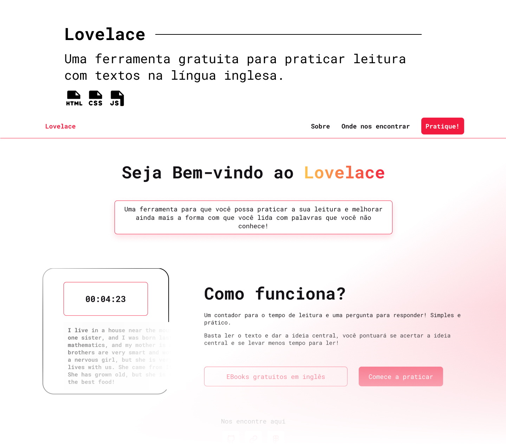

<h1 align="center">
    Lovelace
</h1>

    <a href="#computer-Projeto">Projeto</a>&nbsp;&nbsp;&nbsp;|&nbsp;&nbsp;&nbsp;
    <a href="#rocket-Tecnologias">Tecnologias</a>&nbsp;&nbsp;&nbsp;|&nbsp;&nbsp;&nbsp;
    <a href="#art-Layout">Layout</a>&nbsp;&nbsp;&nbsp;|&nbsp;&nbsp;&nbsp;
    <a href="#memo-Licença">Licença</a>

  

---

## :computer: Projeto

Projeto para fins didáticos em sala de aula para que discentes (alunos) da matéria de lingua inglesa possam praticar sua leitura com textos dinâmicos e simples acompanhados de um docente (professor).

Este foi orientado pela **Prof. Dr. Lenade Barreto**, desenvolvido e idealizado por **Daniel de Santana**, **Marcos Emanuel** e **Melkysedeke Costa**.

## :rocket: Tecnologias

- HTML CSS
- JavaScript
- Git e Github
- Figma

## :art: Layout

O layout do projeto pode ser acessado clicando [aqui](https://www.figma.com/file/Ej7N8rlsG69xa393ALhbnW/Voltaire?node-id=0%3A1&t=13N8ZV5C8l07Xyhr-1). Não é necessário ter uma conta para acessar.

## :memo: Licença

Este projeto está sobre a licença MIT.

---
